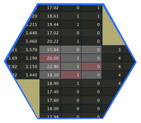

<!-- README.md is generated from README.Rmd. Please edit that file -->

# tablecompare 

<!-- badges: start -->
<!-- badges: end -->

### Defining features:

-   All output is provided as a data frame or list of data frames
-   Comparisons are fast, driven by
    [data.table](https://rdatatable.gitlab.io/data.table/)
-   Functions with column-selecting arguments use
    [tidyselect](https://tidyselect.r-lib.org/)

## Installation

You can install the development version of tablecompare from
[GitHub](https://github.com/) with:

``` r
# install.packages("devtools")
devtools::install_github("eutwt/tablecompare")
```

## Example

``` r
library(tablecompare)
library(data.table)

df_a <- fread('
           car,  mpg, cyl,  disp,  hp, drat,    wt, vs, am
    Duster 360, 14.3,   8, 360.0, 245, 3.21, 3.570,  0,  0
 Mazda RX4 Wag, 21.0,   6, 160.0, 110, 3.90, 2.875,  0,  1
      Merc 230, 22.8,   4, 140.8,  95, 3.92, 3.150,  1,  0
    Datsun 710, 22.8,  NA, 109.0,  93, 3.85, 2.320,  1,  1
     Merc 240D, 24.4,   4, 146.7,  62, 3.69, 3.190,  1,  0
Hornet 4 Drive, 21.4,   6, 259.0, 110, 3.08, 3.215,  1,  0
     Mazda RX4, 21.0,   6, 160.0, 110, 3.90, 2.620,  0,  1
       Valiant, 18.1,   6, 225.0, 105, 2.76, 3.460,  1,  0
      Merc 280, 19.2,   6, 167.6, 123, 3.92, 3.440,  1,  0
')
df_b <- fread('
            car,    wt,  mpg,  hp, cyl,  disp, carb, drat, vs
      Merc 240D, 3.190, 26.4,  62,   4, 146.7,    2, 3.69,  1
        Valiant, 3.460, 18.1, 105,   6, 225.0,    1, 2.76,  1
     Duster 360, 3.570, 16.3, 245,   8, 360.0,    4, 3.21,  0
     Datsun 710, 2.320, 22.8,  93,  NA, 108.0,    1, 3.85,  1
      Merc 280C, 3.440, 17.8, 123,   6, 167.6,    4, 3.92,  1
       Merc 280, 3.440, 19.2, 123,   6, 167.6,    4, 3.92,  1
 Hornet 4 Drive, 3.215, 21.4, 110,   6, 258.0,    1, 3.08,  1
     Merc 450SE, 4.070, 16.4, 180,   8, 275.8,    3, 3.07,  0
       Merc 230, 3.150, 22.8,  95,   4, 140.8,    2, 3.92,  1
  Mazda RX4 Wag, 2.875, 21.0, 110,   6, 160.0,    4, 3.90,  0
')
```

Use `tblcompare()` to see

-   The number of differing values in each column - `tblcompare()$summ`
-   Which columns are in only one table - `tblcompare()$unmatched_cols`
-   Which rows are in only one table - `tblcompare()$unmatched_rows`

``` r
comp <- tblcompare(df_a, df_b, by = car)
comp
#> $tables
#>    table name ncol nrow
#> 1:     a df_a    9    9
#> 2:     b df_b    9   10
#> 
#> $by
#>    column   class_a   class_b
#> 1:    car character character
#> 
#> $summ
#>    column n_diffs class_a class_b       value_diffs
#> 1:    cyl       0 integer integer <data.table[0x5]>
#> 2:   disp       2 numeric numeric <data.table[2x5]>
#> 3:   drat       0 numeric numeric <data.table[0x5]>
#> 4:     hp       0 integer integer <data.table[0x5]>
#> 5:    mpg       2 numeric numeric <data.table[2x5]>
#> 6:     vs       0 integer integer <data.table[0x5]>
#> 7:     wt       0 numeric numeric <data.table[0x5]>
#> 
#> $unmatched_cols
#>    table column   class
#> 1:     a     am integer
#> 2:     b   carb integer
#> 
#> $unmatched_rows
#>    table i        car
#> 1:     a 7  Mazda RX4
#> 2:     b 5  Merc 280C
#> 3:     b 8 Merc 450SE
#> 
#> attr(,"class")
#> [1] "tbcmp_compare"
```

Use `value_diffs()` to see the specific values that are different.

-   The row numbers `i_a` and `i_b` allow for easy subsetting of the
    original tables using the `value_diffs()` output.

``` r
value_diffs(comp, disp)
#>    i_a i_b val_a val_b            car
#> 1:   4   4   109   108     Datsun 710
#> 2:   6   7   259   258 Hornet 4 Drive
value_diffs(comp, mpg)
#>    i_a i_b val_a val_b        car
#> 1:   1   3  14.3  16.3 Duster 360
#> 2:   5   1  24.4  26.4  Merc 240D
```

Use `all_value_diffs()` to combine all `value_diffs()` output into one
table

-   `val_a` and `val_b` are coerced to character

``` r
all_value_diffs(comp)
#>    column i_a i_b val_a val_b            car
#> 1:   disp   4   4   109   108     Datsun 710
#> 2:   disp   6   7   259   258 Hornet 4 Drive
#> 3:    mpg   1   3  14.3  16.3     Duster 360
#> 4:    mpg   5   1  24.4  26.4      Merc 240D
```
